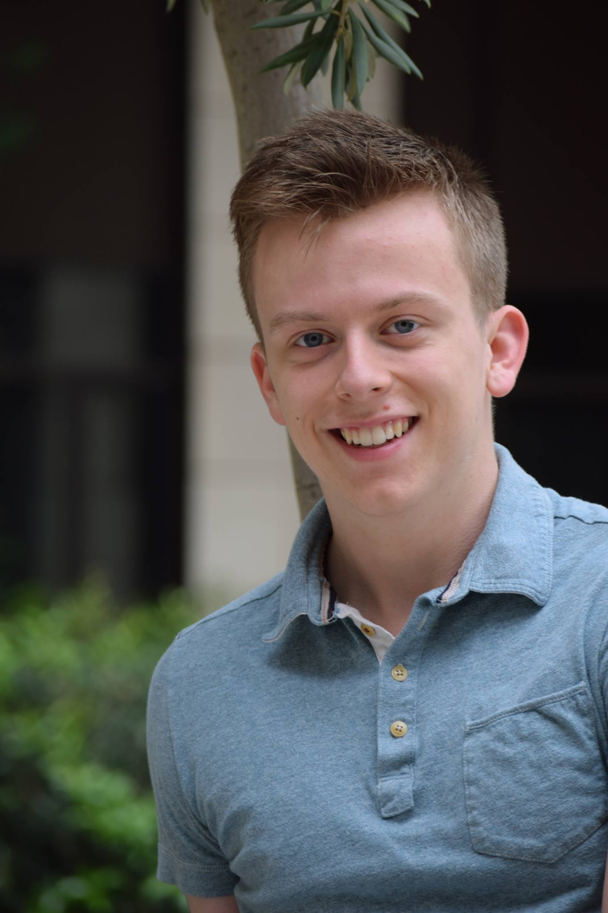
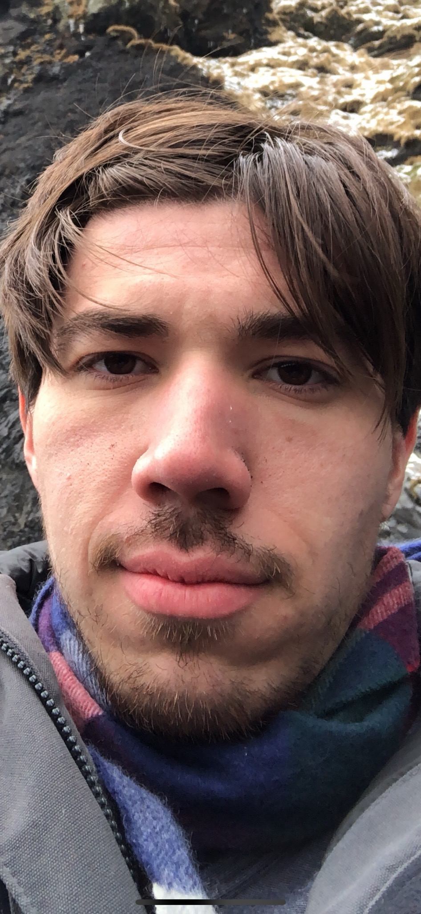
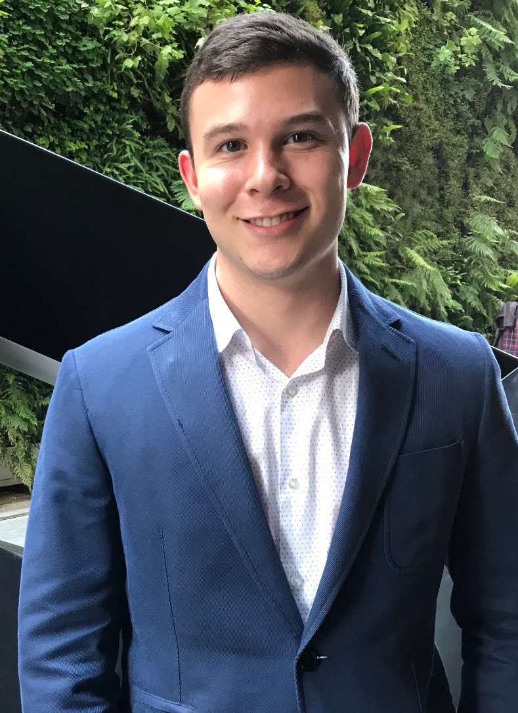
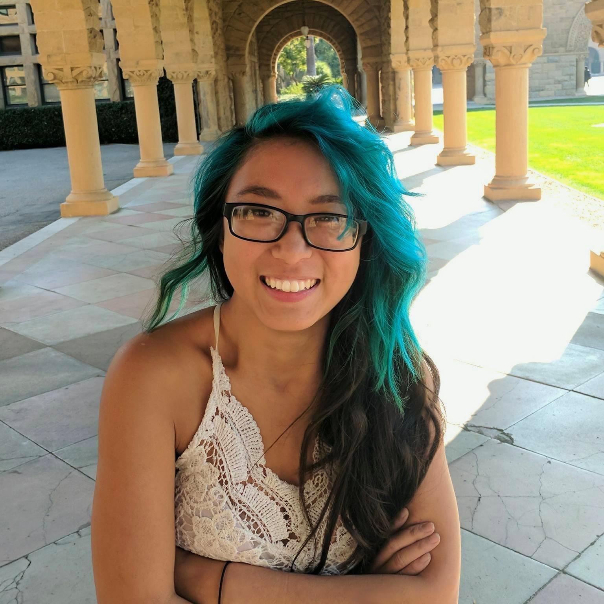

## Synopsis
Helping Hands is an interactive app that makes learning sign language fun and easy! Our app has modules of increasing complexity for language learning, and uses computer vision to provide real-time feedback of student signing.

## Team Members
Our app was built by an amazing team of engineers!

Member | Photograph | Contributions
--- | --- | ---
Swetha Revanur |  | Aggregated and cleaned dataset, trained models, ran debugging experiments, wrote [Computer Vision wiki](https://github.com/StanfordCS194/HelpingHands/wiki/Computer-Vision-Model)
Matt Linker |  | Completed literature review about models and pedagogy, designed and built learning manager, wrote [Learning Model wiki](https://github.com/StanfordCS194/HelpingHands/wiki/Learning-Model)
Gabriel Garza |  | Worked on frontend development, refactored app for modular design, did UI design, wrote [Frontend wiki](https://github.com/StanfordCS194/HelpingHands/wiki/Mobile-Application) 
Andrew Narcomey |  | Worked on artificial data generation, trained models
Christina Li |  | wrote [Backend wiki](https://github.com/StanfordCS194/HelpingHands/wiki/Integration) 

## Profiles
| Member        | Skills           | Personal Traits  | Desired Growth | Weaknesses 
| ------------- |:-------------:| -----:|---|---
| Swetha Revanur | Python, ML, vision, public speaking | Big picture, organized | New tech stack | Overambitious, hardware
| Matt Linker | Python, arbitrage, NLP, public speaking | Cooperative, confident | Iterative development | Frontend, needs to have motivation
| Gabriel Garza | Backend, infrastructure | Hard-working, flexible, divergent thinker | Reliability, computer vision | Time management
| Andrew Narcomey | Python, ML, NLP | Organized, hard-working | Iterative development | Frontend, perfectionist
| Christina Li | Python, C, robotics, mechanical design | cooperative, open minded, interdiscplinary | iterated development, ML, NLP, front end | ML, very goal-oriented

## Communication
We communicate internally over text, and maintain documentation on Github and Google Documents. Individually, we can be reached at srevanur@stanford.edu, mslinker@stanford.edu, ggarza5@stanford.edu, aon1@stanford.edu, and cli7@stanford.edu.
