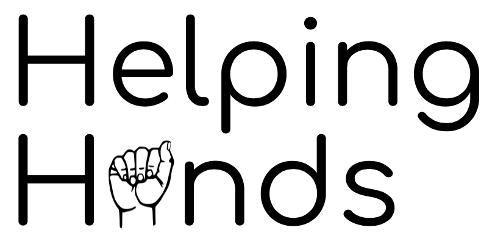
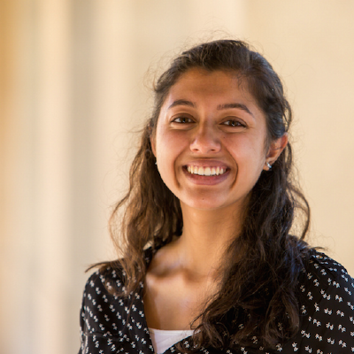
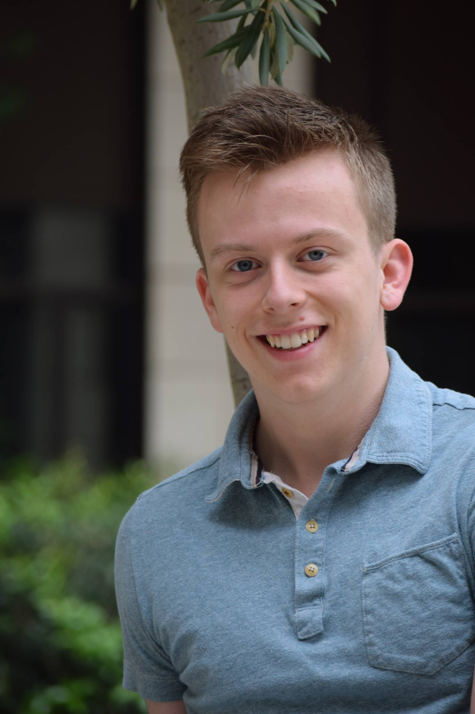
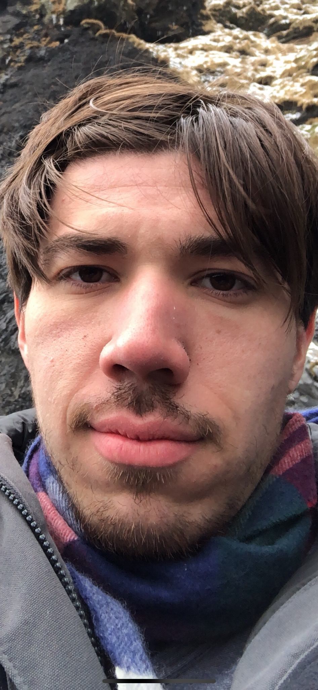
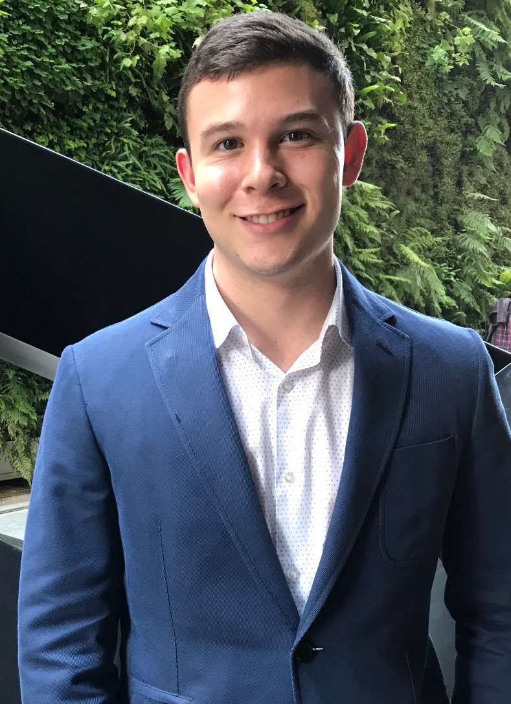
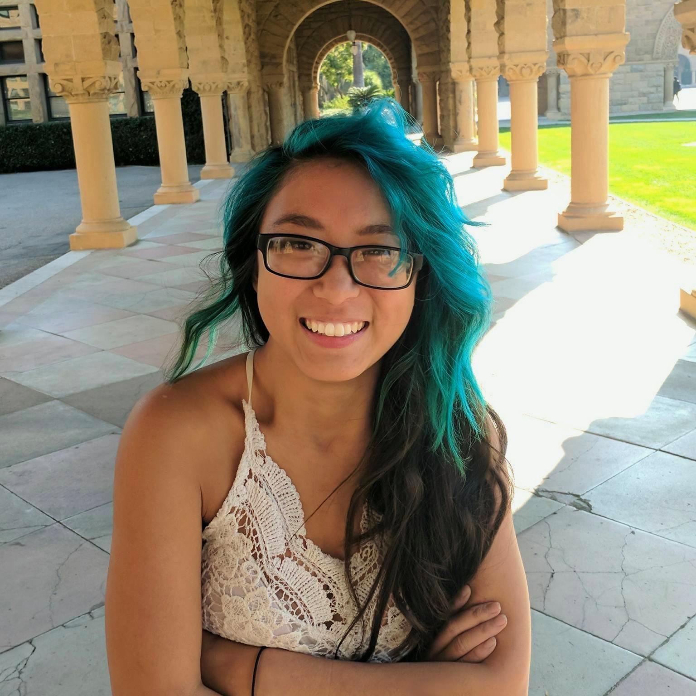

# Helping Hands

## Synopsis
Helping Hands is an interactive app that makes learning sign language fun and easy! Our app has modules of increasing complexity for language learning, and uses computer vision to provide real-time feedback of student signing.

## Team Members

Member | Photograph
--- | ---
Swetha Revanur | 
Matt Linker | 
Gabriel Garza | 
Andrew Narcomey | 
Christina Li | 

## Profiles
| Member        | Skills           | Personal Traits  | Desired Growth | Weaknesses 
| ------------- |:-------------:| -----:|---|---
| Swetha Revanur | Python, ML, vision, public speaking | Big picture, organized | New tech stack | Overambitious, hardware
| Matt Linker | Python, arbitrage, NLP, public speaking | Cooperative, confident | Iterative development | Frontend, needs to have motivation
| Gabriel Garza | Backend, infrastructure | Hard-working, flexible, divergent thinker | Reliability, computer vision | Time management
| Andrew Narcomey | Python, ML, NLP | Organized, hard-working | Iterative development | Frontend, perfectionist
| Christina Li | Python, C, robotics, mechanical design | cooperative, open minded, interdiscplinary | iterated development, ML, NLP, front end | ML, very goal-oriented

## Communication
We communicate internally over text, and maintain documentation on Github and Google Documents. Individually, we can be reached at srevanur@stanford.edu, mslinker@stanford.edu, ggarza5@stanford.edu, aon1@stanford.edu, and cli7@stanford.edu.
